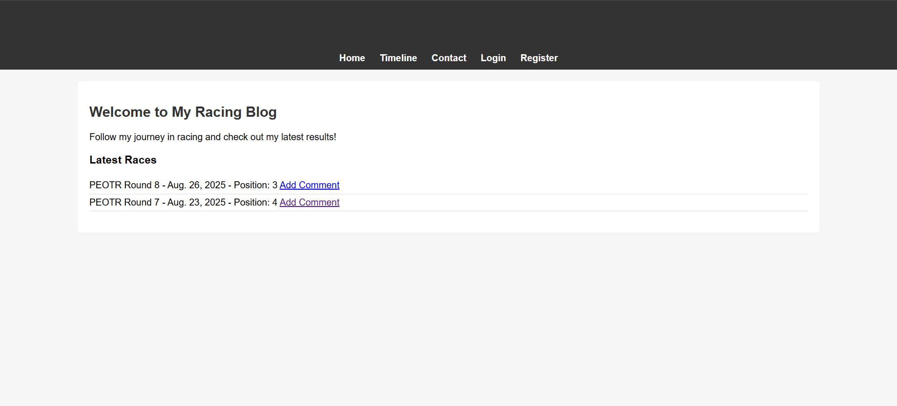
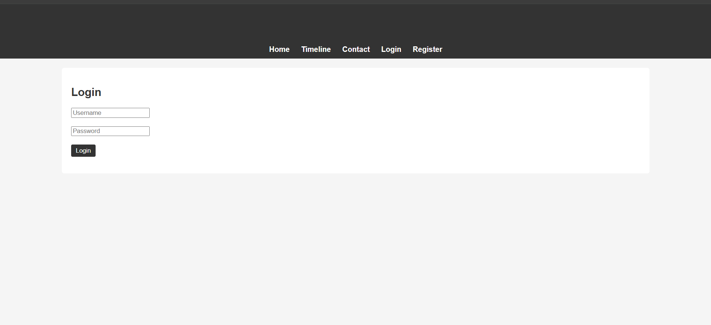
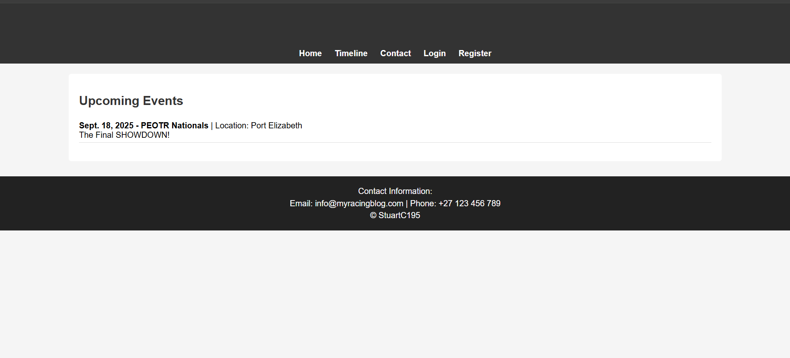

# Racing Blog

## Repository
[View on GitHub](https://github.com/YaBoiStui/Django-Capstone)


## Description
Racing Blog is a Django-powered web application that allows motorsport enthusiasts to explore, share, and discuss racing-related content on my career. It features user authentication, blog posts about races, and event listings.

Developed as my Django Capstone project, this app demonstrates full-stack development skills using Django, Python, HTML, CSS, and a database backend.

## Table of Contents
- [Installation](#installation)
- [Usage](#usage)
- [Screenshots](#screenshots)
- [Credits](#credits)

## Installation

1. **Clone the repository**  
   ```bash
   git clone https://github.com/YaBoiStui/Django-Capstone.git
   cd Django-Capstone
   ```

2. **Create and activate a virtual environment**  
   ```bash
   python -m venv venv
   source venv/bin/activate   # On Mac/Linux
   venv\Scripts\activate      # On Windows
   ```

3. **Apply database migrations**  
   ```bash
   python manage.py migrate
   ```

4. **Run the development server**  
   ```bash
   python manage.py runserver
   ```

## Usage

- Open a browser and go to `http://127.0.0.1:8000/`
- Sign up or log in to post and interact.
- Browse existing blog posts and event pages to get racing highlights.

## Screenshots


- **Homepage**  
  

- **Login Page**  
  

- **Events Page**  
  

## Credits

Created by:  
- **Stuart Van Tonder** — [GitHub Profile](https://github.com/YaBoiStui)
